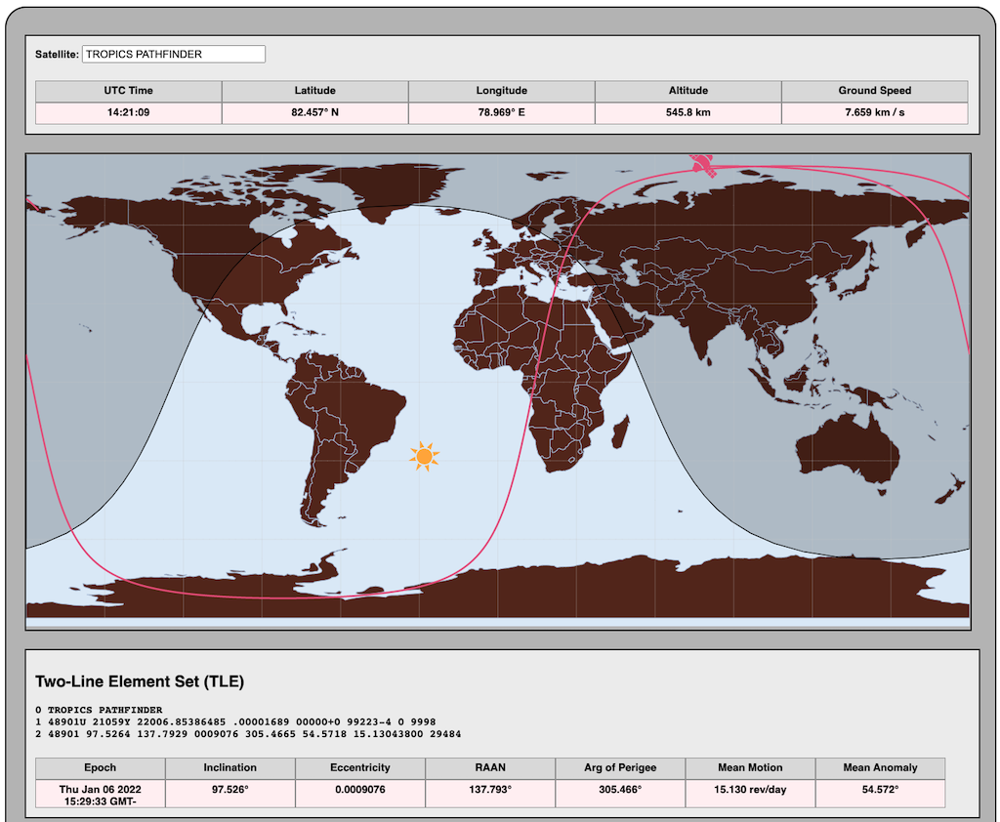
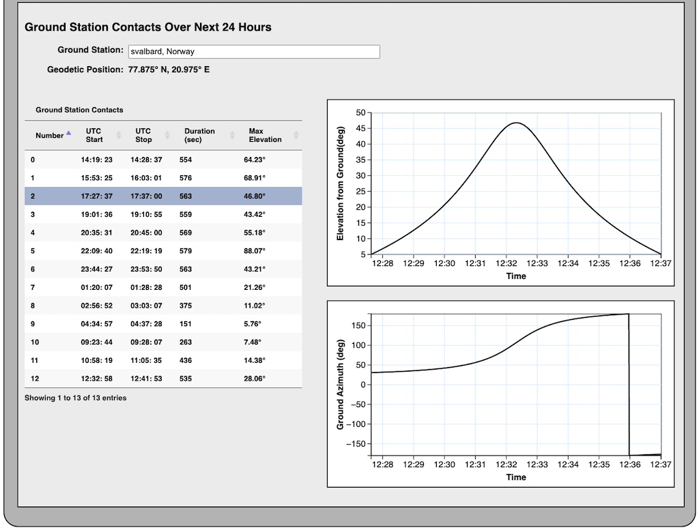

# **Astronomy Toolkit**

## **Introduction**

The Astronomy Toolkit is a javascript module for handling a few simple satellite and astronomy tasks, including:

* Propagation of two-line element sets representing satellite ephemerides via native JavaScript translation of Vallado SGP4 propagator
* Planetary ephemerides (low precision from NASA JPL)
* Sun & Moon ephemerides
* Coordinate conversions between Earth-fixed and inertial space
* Class for handling International Terrestrial Reference Frame
    * Conversion to and from geodetic coordines (latitude, longitude, height)
    * Conversion to East-North-Up, North-East-Down relative to reference position
* Extension of Date class to add functions for Julian Date & Modified Julian Date output with optional time base (UTC, TAI, TT, GPS)

## **References**

The code in this document draws heavily on the following canonical texts:

* Vallado, David L.  *Fundamentals of Astrodynamics and Applications*, 4th edition. Microcosm Press and Springer, 2013.
* Montenbruck, Oliver and Gill, Eberhard. *Satellite Orbits: Models, Methods, Applications*.  Springer, 2000.
* Urban, Sean E. and Seidelmann, P. Kenneth. *Explanatory Supplement to the Astronomical Almanac*, 3rd edition.  University Science Books.  2013.

## **Validation**

The <tt>tests</tt> directory includes tests of included algorhithms.  These include:

* Code for importing test TLEs from "official" Vallado distribution of C++ sgp4 implementation, and comparing computed positions and velocities against "official" test vectors 
* Implementation of various examples from the above reference literature for solar system ephemerides & time conversion
* Test written by the author to verify quaternions, extension of Date class, actions on vectors, etc...

The <tt>tape</tt> module, https://www.npmjs.com/package/tape, is used for test management.

## **Examples** 

Examples are included in the <tt>examples</tt> directory and can be run via [Node.js](http://nodejs.org/)
* **<tt>iss_groundtrack.js</tt>**: Given input TLE for the international space station (ISS), compute the ground track (longitude and latitude) over a single orbit

* **<tt>satellite_comm_access.js</tt>**: Given input TLE for the TROPICS Pathfinder satellite (sun synchronous orbit), compute contact times over an orbit for the communications ground station in Svalbard, Norway

* **<tt>solarpanels.js</tt>**: Use sun position and rotation to Earth-fixed frame to compute maximum expected power generation of solar panel system (in this case, the one on the roof of my house)

For reference the code for <tt>iss_groundtrack.js</tt> is below.

```js
// Import the astrokit
import * as ak from '../src/index.js'

// A recent (9/24/2021) TLE for the international space station
// as downloaded from www.space-track.org
const tle_lines = [
    '0 ISS(ZARYA)',
    '1 25544U 98067A   21267.21567994  .00001839  00000-0  42318-4 0  9994',
    '2 25544  51.6435 213.0833 0003460  47.4035  50.6925 15.48430119303944',
]

// Load the TLE into javascript class
// Note: this will automatically detect if the first line with name 
//       identifier is omitted
let iss = new ak.TLE(tle_lines)

// Duration of time over which to compute ground track
// Equal to 1 revolution (mean motion is revs / day)
let rate = Math.PI * 2 / 86400 * iss.mean_motion
// Duration is in seconds (86400 seconds / day)
let duration = 2 * Math.PI / rate

// Create array of times for which to compute positions
// In this case, the start time is the "epoch" for the TLE
// and the times are every 10 seconds over a single orbit
let dt = 10
const times = [...Array(Math.floor(duration / dt)).keys()]
    .map(x => new Date(iss.epoch.getTime() + x * dt * 1000))

// Get the ground position for each time
let iss_groundtrack = times.map((t) => {
    // Get the position and velocity in the TEME coordinate frame
    // by running "sgp4" orbit propagator with iss TLE and
    // desired time as input
    let rv = ak.sgp4(iss, t)

    // Get quaternion to rotate from TEME frame to ITRF frame
    // TEME = Earth-centered pseudo-inertial frame in which sgp4
    //        computes the positions and velocities
    // ITRF = international terrestrial reference frame
    // and turn it into a coordinate class
    let itrf = new ak.ITRFCoord(ak.qTEME2ITRF(t).rotate(rv.r))

    // Use the coordinate class (which is cartesian ITRF natively)
    // to extract geodetic latitude, longitude, and height
    return {
        time: t,
        latitude_deg: itrf.latitude_deg(),
        longitude_deg: itrf.longitude_deg(),
        height_meters: itrf.height()
    }
})
// print output to screen
console.log(iss_groundtrack)
```

## **Install and Build**

### **Local Install and Build**

The source code is available at: https://github.com/StevenSamirMichael/astrokit

The javascript is written natively in ES6, and must be converted for use in html.  This can be done via the following:
* Install [Node.js](https://nodejs.org/) and Node package manager
* Install package dependencies. From top-level directory of repo, run:
    ```
    npm install
    ```
* If desired, run test scripts
    ```
    npm run test
    ```
* Build javascript for insertion into web pages. This will create files <tt>dist/astrokit.js</tt> and <tt>dist/astrokit.min.js</tt>

    ```
    npm run build
    npm run build:min
    ```
<br>

### **Install via Package Manager**

The code is also available via the Node package manager and can be added to javascript modules and applications in the standard way:
```
npm install astrokit
```
<br>
<br>

### **Including in HTML**
Example usage is below.  This is a javascript module, with exported name <tt>ak</tt> in the global scope created by using <tt>astrokit/dist/astrokit.min.js</tt>

```html
<head>
        <script type="module" src="astrokit/dist/astrokit.min.js"></script>
</head>
<body>
    <script>
        // Lines for a TLE
        // International Space Station, downloaded from www.space-track.org, 9/24/21
        const tle_lines = [
        '0 ISS(ZARYA)',
        '1 25544U 98067A   21267.21567994  .00001839  00000-0  42318-4 0  9994',
        '2 25544  51.6435 213.0833 0003460  47.4035  50.6925 15.48430119303944',
        ]
        
        // Create a TLE object using the above lines
        let tle = ak.TLE(tle_lines)

        // Find satellite position at given time
        // Midnight UTC on Sept 25, 2021
        let thetime = Date(Date.UTC(2021, 8, 25))
        // Run SGP4 propagator
        results = ak.sgp4(tle, thetime)

        // Position, in meters, in teme frame is in results.r
        // Velocity, in meters / second, in TEME frame is in results.v
        
        // Rotate position to ITRF frame
        // and wrap an ITRF coordinate class around it.
        let ITRF = ak.ITRFCoord(ak.qTEME2ITRF(thetime).rotate(results.r))

        // get latitude and longitude
        let latitude = ITRF.latitude_deg()
        let longitude = ITRF.longitude_deg()
        let height = ITRF.height()
    </script>
</body>
```

## **Example Satellite Tracker**

The distribution includes an example web application that can be run against the local version of the code.  The application shows the ground track of active satellites with ephemeris downloaded from http://www.celestrak.org/.  The application will also show and plot ground station contact times for the chosen satellite and a user-chosen ground station location.  With a NodeJS that supports ES6 installed, run,

```
cd examples/web
npm install
node ./App.js
```



<br>


## **License**

<tt>
Copyright 2022 Steven Michael (ssmichael@gmail.com)

Permission to use, copy, modify, and/or distribute this software for any purpose with or without fee is hereby granted, provided that the above copyright notice and this permission notice appear in all copies.

THE SOFTWARE IS PROVIDED "AS IS" AND THE AUTHOR DISCLAIMS ALL WARRANTIES WITH REGARD TO THIS SOFTWARE INCLUDING ALL IMPLIED WARRANTIES OF MERCHANTABILITY AND FITNESS. IN NO EVENT SHALL THE AUTHOR BE LIABLE FOR ANY SPECIAL, DIRECT, INDIRECT, OR CONSEQUENTIAL DAMAGES OR ANY DAMAGES WHATSOEVER RESULTING FROM LOSS OF USE, DATA OR PROFITS, WHETHER IN AN ACTION OF CONTRACT, NEGLIGENCE OR OTHER TORTIOUS ACTION, ARISING OUT OF OR IN CONNECTION WITH THE USE OR PERFORMANCE OF THIS SOFTWARE
</tt>
